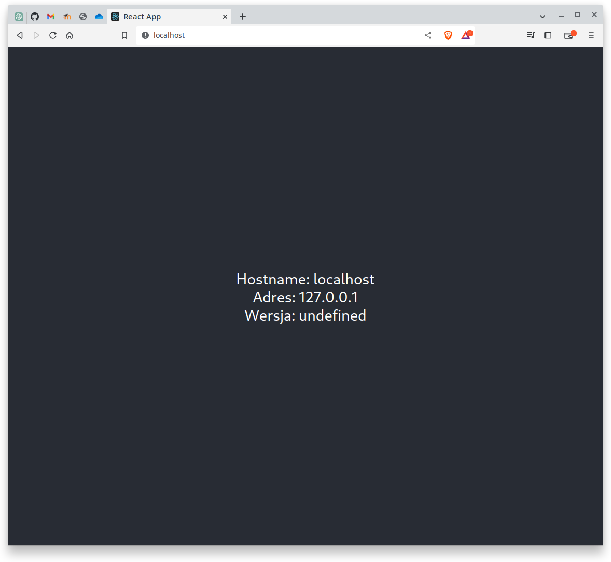
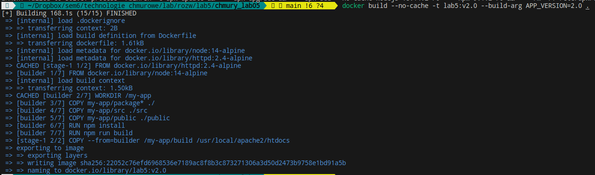
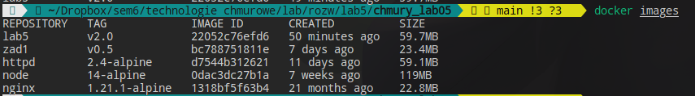
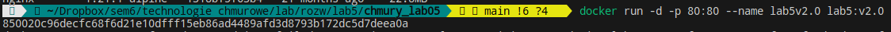
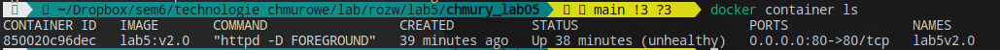
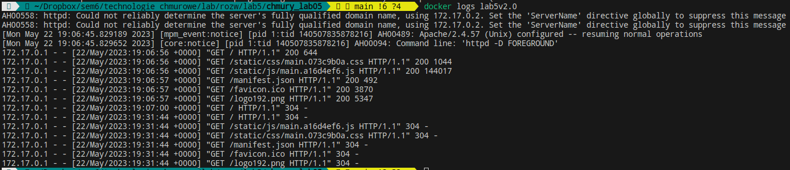

# chmury_lab05

Michał Galant

Sprawozdanie z laboratorium 5 z technologii chmurowych.

---

### 1. Działanie aplikacji



---

### 2. Struktura aplikacji

#### 1. Dockerfile

```dockerfile
#
# Michał Galant
#

# ETAP 1 : budowanie

# wykorzystanie obrazu node w wersji 14-alpine jako bazowego - do budowania
FROM node:14-alpine as builder

# parametr VERSION do przekazania wersji obrazu
ARG APP_VERSION
# wprowadzenie zmiennej środowiskowej i przypisanie do niej wartości VERSION
ENV APP_VERSION=${APP_VERSION}

# ustawienie katalogu roboczego
WORKDIR /my-app

# skopiowanie całej aplikacji
COPY my-app/package* ./
COPY my-app/src ./src
COPY my-app/public ./public

# instalacja zależności
RUN npm install
# zbudowanie aplikacji
RUN npm run build

# ETAP 2 : wystawienie aplikacji

# wykorzystanie obrazu apache
FROM httpd:2.4-alpine

# przekazanie parametru i zmiennej środowiskowej do serwera
ARG APP_VERSION
ENV APP_VERSION=${APP_VERSION}

# skopiowanie zbudowanej aplikacji do serwera
COPY --from=builder /my-app/build /usr/local/apache2/htdocs

# wystawienie aplikacji na port 80
EXPOSE 80

# monitorowanie stanu aplikacji na serwerze
HEALTHCHECK --interval=10s --timeout=1s\
    CMD curl -f http://localhost:80/ || exit 1

# uruchomienie serwera
CMD ["httpd", "-D", "FOREGROUND"]
```

#### 2. App.js

```js
import "./App.css";
// przypisanie wartości zmiennej środowiskowej do zmiennej w aplikacji
export const ver = process.env.APP_VERSION;

function App() {
  // jeżeli adresem ip będzie http://localhost to zamień go na 127.0.0.1
  const origin = window.location.origin;
  const address = origin == "http://localhost" ? "127.0.0.1" : origin;

  return (
    <div className="App">
      <header className="App-header">
        {"Hostname: " + window.location.hostname}
        <br></br>
        {"Adres: " + address}
        <br></br>
        {"Wersja: " + ver}
      </header>
    </div>
  );
}

export default App;
```

---

### 3. Uruchomienie aplikacji

#### 1. Zbudowanie obrazu

`docker build --no-cache -t lab5:v2.0 --build-arg APP_VERSION=2.0 . `





#### 2. Uruchomienie kontenera na bazie utworzonego obrazu

`docker run -d -p 80:80 --name lab5v2.0 lab5:v2.0`





#### 3. Diagnostyka

`docker logs lab5v2.0`


